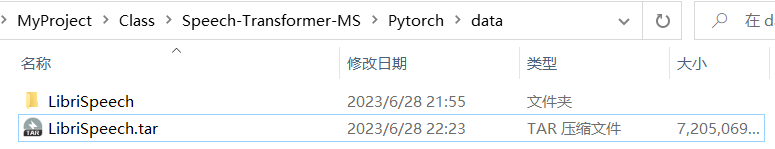
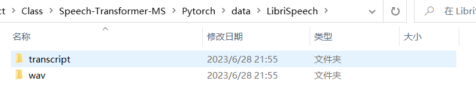
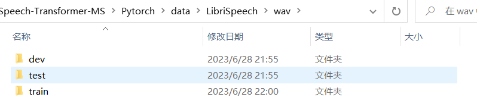
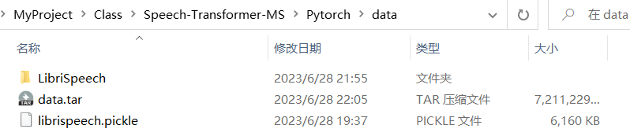
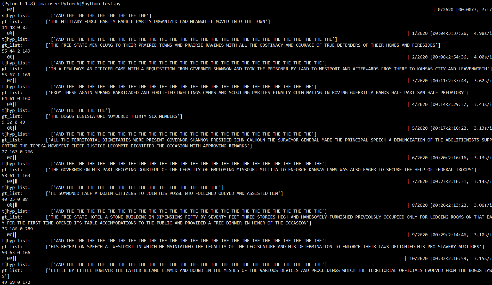
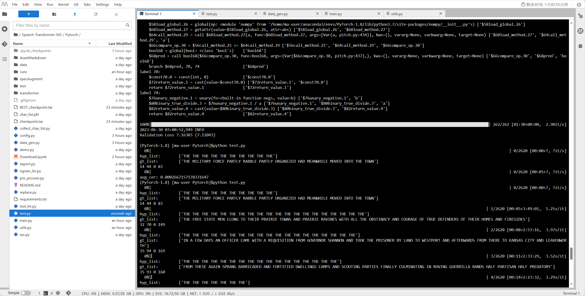

# Speech Transformer

```shell
# CUDA 11.3
pip install torch==1.12.1+cu113 torchvision==0.13.1+cu113 torchaudio==0.12.1 --extra-index-url https://download.pytorch.org/whl/cu113
```

## 1.上传数据至`data`文件夹，并解压缩

```shell
tar -xvf ./LibriSpeech.tar
```







## 2.预处理生成`.pickle`文件

```shell
python pre_process.py 
```



## 3.开始模型训练

```shell
python train.py
```

可视化runs

```bash
tensorboard --logdir runs
```

下载checkpoint

```python
import os
print(os.getcwd())

import moxing as mox
mox.file.copy('./BEST_checkpoint.tar', 'obs://nlang/ASR/BEST_checkpoint.tar')
mox.file.copy('./checkpoint.tar', 'obs://nlang/ASR/checkpoint.tar')
```


## 4.预测

```bash
python test.py
```



